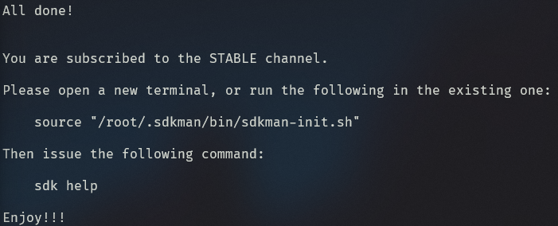
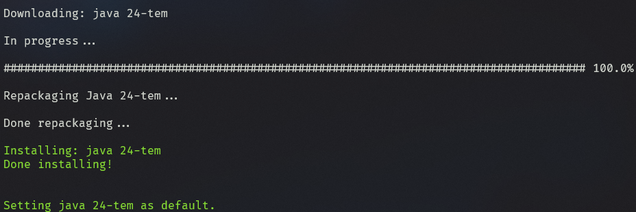

## Escolhendo o JDK





O primeiro passo para configurar seu ambiente java é a escolha do JDK (**J**ava **D**evelopment **K**it)

Caso não tenha restrições, utilize o `Temurin JDK` disponibilizado pela `Adoptium`, este pode ser baixado por meio do link: [Releases: Temurin JDK](https://adoptium.net/temurin/releases/).

Caso esteja utilizando macOS, linux ou WSL, podemos utilizar o [SDKMAN!](https://sdkman.io/install/) tornando o processo de instalação, configuração e troca de versão muito mais simples. Para ambientes que precisam da troca constante de versão do JDK este tipo de ferramental pode economizar muito tempo no cotidiano.

---

## Instalando o SDKMAN

A instalação é bem simples e o passo a passo pode mudar, por isso vá a [documentação oficial](https://sdkman.io/install/).

Na data deste documento (20/09/25), foi utilizado `WSL` com `Ubuntu 24.04.3 LTS` com os seguintes passos:

1. Atualize os pacotes do sistema:

    ```sh
    sudo apt update -y && sudo apt upgrade -y
    ```

2. Instale o unzip e zip para descompactar/compactar arquivos:

    ```sh
    sudo apt install unzip zip -y
    ```

3. Instale o SDKMAN:

    ```sh
    curl -s "https://get.sdkman.io" | bash
    ```

4. Após a conclusão devemos ver uma mensagem de sucesso. Revise os passos caso encontre algum erro. 

5. Reinicie o terminal ou execute o comando abaixo para habilitar os alias do sdkman.

    ```sh
    source "/root/.sdkman/bin/sdkman-init.sh"
    ```

---

## Instalando JDK

Antes de instalar, podemos visualizar os JDK disponiveis no SDKMAN usando:

```sh
sdk list java
```

Para este cenário, vamos utilizar o JDK `24-tem`.

A instalação deve ser tão simples quanto executar o comando abaixo:

```sh
sdk install java 24-tem
```

Após a instalação finalizar devemos ter novamente uma mensagem de sucesso. 

Confirme a instalação verificando a versão do java:

```sh
java -version
```

O comando acima deve retornar algo similar a:

```sh
openjdk version "24" 2025-03-18
OpenJDK Runtime Environment Temurin-24+36 (build 24+36)
OpenJDK 64-Bit Server VM Temurin-24+36 (build 24+36, mixed mode, sharing)
```

Caso o `java -version` de erro ou não encontre JDK, revise os passos acima

---

## Alterando JDK

Para realizar a troca do JDK utilize o comando `use`, alterando `24-tem` para a versão desejada:

```sh
sdk use java 24-tem
```

---

## Visualizando o JDK em uso

Para visualizar o JDK atualmente em uso, utilize:

```sh
sdk current java
```

---

## Desinstalando JDK

Para desinstalar o JDK utilize:

```sh
sdk uninstall java 24-tem
```
